<h1 align="center">Hi there, I'm Sea 👋</h1>

  <b>Full-Stack Engineer</b> | Web Apps | E-Commerce | Cloud &amp; DevOps

  I build production-grade web applications end to end - from pixel-perfect frontends
  to resilient backends, payment flows, and the CI/CD &amp; Kubernetes pipelines that ship them.

---

### 🚀 What I do

- 🧩 **Full-stack product development** with React / Next.js and Vue / Nuxt on the frontend, Node.js, Python/Django, and PHP on the backend.
- 🔌 **API design & integration** - REST and GraphQL services, third-party APIs, webhooks, and real-time features with WebSockets.
- 🛒 **E-commerce & CMS** - custom Shopify builds (themes, Liquid, apps), WooCommerce, and WordPress solutions, including headless setups.
- 💳 **Payment integrations** - Stripe, PayPal, and gateway work wired into real checkout flows: subscriptions, webhooks, refunds, and reconciliation.
- ☁️ **DevOps & Cloud** - containerized delivery on Kubernetes, GitOps with ArgoCD, IaC with Terraform, and automated pipelines via GitHub Actions.
- 🔐 **Secure by default** - secret managers (Vault / cloud-native), environment isolation, and least-privilege deployments.
- ⚡ **Performance & quality** - SSR/SSG optimization, Core Web Vitals, caching strategies, and automated testing from unit to E2E.

---

### 🛠️ Tech Stack

<table>
  <tr>
    <td valign="middle" width="180"><b>Languages</b></td>
    <td>
      
      
      
      
      
      
      
      
    </td>
  </tr>
  <tr>
    <td valign="middle"><b>Frontend</b></td>
    <td>
      
      
      
      
      
      
      
      
      
    </td>
  </tr>
  <tr>
    <td valign="middle"><b>Backend &amp; APIs</b></td>
    <td>
      
      
      
      
      
      
      
      
    </td>
  </tr>
  <tr>
    <td valign="middle"><b>CMS, E-Commerce &amp; Payments</b></td>
    <td>
      
      
      
      
      
    </td>
  </tr>
  <tr>
    <td valign="middle"><b>Databases &amp; Caching</b></td>
    <td>
      
      
      
      
      
      
      
    </td>
  </tr>
  <tr>
    <td valign="middle"><b>DevOps &amp; Cloud</b></td>
    <td>
      
      
      
      
      
      
      
      
      
      
      
      
      
    </td>
  </tr>
  <tr>
    <td valign="middle"><b>Testing &amp; Quality</b></td>
    <td>
      
      
      
      
      
    </td>
  </tr>
  <tr>
    <td valign="middle"><b>Workflow &amp; Collaboration</b></td>
    <td>
      
      
      
      
      
      
      
    </td>
  </tr>
</table>

---

### 📊 GitHub Stats

<!--
  Generated by .github/workflows/metrics.yml (lowlighter/metrics) using your
  read-only PAT stored in secrets.METRICS_TOKEN. Includes PRIVATE repos.
  This image won't exist until the Metrics workflow runs once and commits it.
-->

  

  

---

### 💡 A bit more

- 🔭 Comfortable owning a feature from database schema to deployed pipeline.
- 🏗️ Care about architecture: clean separation, scalable services, and code that the next developer can read.
- 🤝 Experienced working in Agile teams - Jira boards, PR reviews, and clean Git workflows.
- 🌱 Always exploring better ways to ship fast without breaking production.

---

  <i>Let's build something great. ⚡</i>

